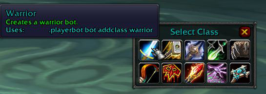

## UnBot for AzerothCore Module

A bot control plugin modified based on the UnBot plugin. As a supporting plugin for the AzerothCore Playerbot module, it is convenient for players to control bots.

Installation method: Put UnBot in the Interface/AddOns/ directory

Plugin interface display:

Add a bot of a specific profession:

* Removed all external dependencies
* Strategy redone
* Some bugs fixed
* Obosolete bot commands fixed to follow current PB state
* Some personal flavoring added to Inventory and Icons forms
* and whtever I forgot to remember....
* en-US or en-GB version only
